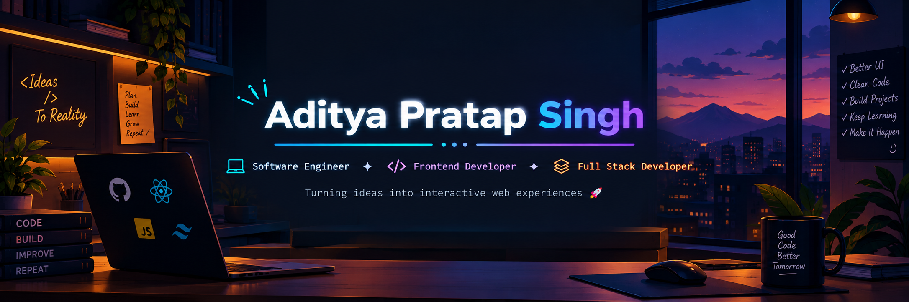

<!-- ======================= BANNER ======================= -->

<p align="center">
  
</p>

<br>

<!-- ======================= INTRO ======================= -->

<div align="center">

# 👋 Hey, I'm Aditya Pratap Singh

### 💻 Software Engineer • 🎨 Frontend Developer • ⚡ Full Stack Developer


</div>

---

<!-- ======================= ABOUT ======================= -->

## 👨‍💻 About Me

I'm a **B.Tech Computer Science student** passionate about software development, problem solving, and building real-world applications.

- 💻 Focused on **Web Development**
- 🎨 Building responsive and interactive **Frontend applications**
- ⚡ Exploring **Full Stack Development**
- 🧠 Practicing **C++ & Data Structures & Algorithms**
- ⚛️ Learning and building with **React**
- 🚀 Creating projects to turn ideas into working products
- 📚 Continuously improving my development and problem-solving skills
- 🎯 Goal: Become a strong **Software Engineer**

---

<!-- ======================= CURRENT FOCUS ======================= -->

## 🚀 Currently Learning & Building

```text
Frontend Development     ███████████████████░░   React • JavaScript • CSS
Full Stack Development   ████████████████░░░░░   APIs • Backend • Databases
DSA & Problem Solving    █████████████████░░░░   C++ • LeetCode
Projects                 ████████████████████░   Building & Improving
